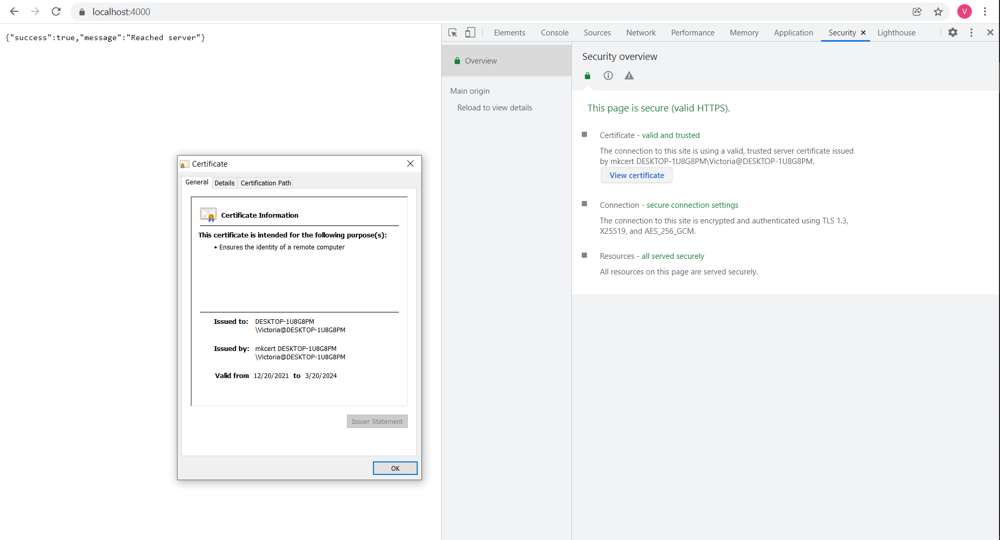

# 7 лаба

Станом на 2021 рік використання tsl 1.1 не бажано, варто використовувати останню версію tsl 1.3
В ході виконання лабораторної я згенерувала сертифікат (*.pem), CA (*-ca.pem) та ключ (*-key.pem).
При генерації використовувала aes-256. 
В результаті в браузері сертифікат виглядає так:

Налаштувала перенаправлення з http на https.